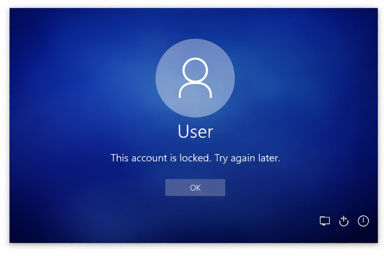
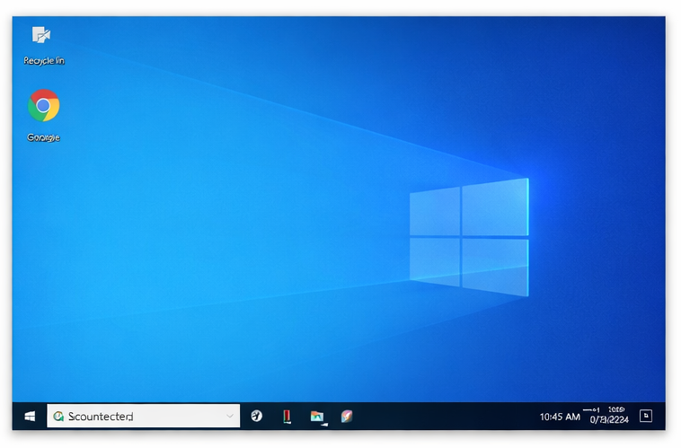

# User Account Lockout – IT Support Ticket

## Issue
User reported that their Windows account was locked and they could not log in.

## Environment
- Operating System: Windows 10
- Account Type: Local / Active Directory

## Troubleshooting Steps
1. Verified username and password.
2. Checked account lockout status in Active Directory.
3. Reset account password and unlocked account.
4. Instructed user to wait 15 minutes for account unlock (if temporary lockout).
5. Tested successful login.

## Root Cause
Multiple incorrect login attempts triggered account lockout policy.

## Resolution
Account was unlocked and user was able to log in successfully.

## Screenshots
### Account Locked

### Account Unlocked

## Status
Resolved